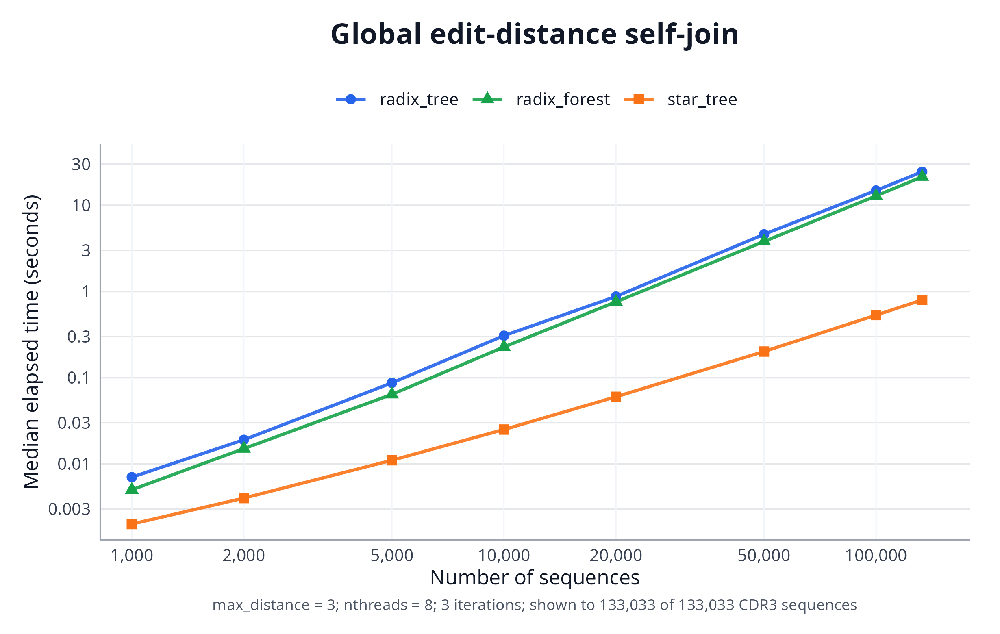
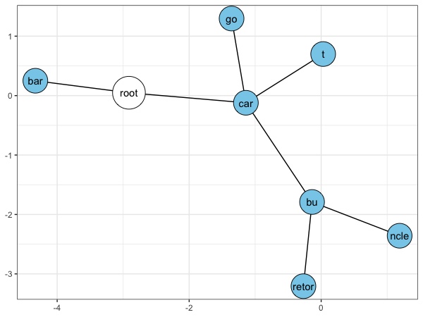

```{r, setup, echo=FALSE}
GITHUB_README <- Sys.getenv("GITHUB_README") != ""
knitr::opts_chunk$set(dpi=96,fig.width=6.5)
library(seqtrie)
```

### Background

`seqtrie` is a collection of radix tree algorithms for finding similar strings,
with a focus on biological sequence data. Here, "similar" usually means close
under Hamming distance, Levenshtein distance, or semi-global alignment.

A radix tree, also called a compressed trie, is an efficient data structure for
searching large sets of sequences. It stores shared prefixes once, so a search
can skip whole branches instead of checking every sequence one by one.

For bounded-distance searches, this can be sub-linear in the number of stored
sequences because the tree can prune whole branches.

### Basic usage

One common job is a similarity join: find every pair of sequences within a fixed
distance. The example below has 133,033 TCR beta CDR3 DNA sequences (Nolan et al. 2020).

```{r, basic_usage, eval=FALSE}
data(covid_cdr3)
results <- dist_search(covid_cdr3, max_distance = 3,
                       nthreads = 8, tree_class = "StarTree")
```

Trie-based algorithms are a good fit for this kind of search. The tree
structure lets `seqtrie` rule out large groups of targets without checking every
sequence against every other sequence.

### Tree classes

`seqtrie` has three tree classes.

- **RadixTree** (`radix_tree()`): the classic radix tree and the most
  general-purpose class. It supports insertion, deletion, prefix lookup, Hamming
  search, Levenshtein search, custom costs, single-gap search, and anchored
  search.
- **RadixForest** (`radix_forest()`): many radix trees, split by sequence
  length. This can be faster for Hamming and Levenshtein searches, especially
  when length is informative.
- **StarTree** (`star_tree()`): a specialized DNA similarity join class. It is a
  modified version of the Starcode all-pairs search algorithm from Zorita,
  Cuscó, and Filion (2015), adapted to operate over a radix trie rather than
  being a direct reimplementation. It supports fixed global/Levenshtein joins,
  fixed anchored joins (`mode = "anchored"`), and fixed Hamming joins
  (`mode = "hamming"`). For small edit-distance DNA self-joins it typically
  outperforms the other two classes (see the benchmark below).

`dist_search()` is a convenience wrapper around these classes. It can search for
similarity between `query` and `target`, or within `query` when `target` is
`NULL`.

Below is a benchmark applying `dist_search` to the `covid_cdr3` dataset.

```{r, tree_benchmark, eval=!GITHUB_README, echo=FALSE, out.width="100%", fig.cap="Global edit-distance self-join benchmark with max_distance = 3 and nthreads = 8."}

```

```{r, tree_benchmark_github, eval=GITHUB_README, echo=FALSE, results='asis'}
cat('')
```

### Understanding Radix Trees

Here is a small radix tree. We insert a few strings, erase one, and plot the
result.

The useful part is the shared prefix. `cargo`, `cart`, `carburetor`, and
`carbuncle` all start with `car`, so the tree stores `car` once. After that, it
only stores the pieces where the strings split.

```{r, basic_plot, eval=FALSE}
tree <- radix_tree()
insert(tree, c("cargo", "cart", "carburetor", "carbuncle", "bar", "zebra"))
erase(tree, "zebra")
# plot_tree requires igraph and ggplot2
set.seed(1); plot_tree(tree)
```

```{r, basic_plot_static, eval=!GITHUB_README, echo=FALSE, out.width=400}

```

```{r, basic_plot_github, eval=GITHUB_README, echo=FALSE, results='asis'}
cat('')
```

```{r, cdr3_setup, echo=FALSE}
# 130,000 "CDR3" sequences
set.seed(1)
data(covid_cdr3)
covid_cdr3 <- sample(covid_cdr3, 1000)
tree <- radix_tree()
insert(tree, covid_cdr3)
```

### Hamming distance search

Hamming distance is similar to Levenshtein distance, but it does not allow
insertions or deletions. Sequences must be the same length. Because of this
restriction, Hamming distance is generally a lot faster.

Use `max_fraction` to set the distance threshold relative to query length. For
example, `max_fraction = 0.06` keeps matches within roughly 6% Hamming distance.

```{r, hm_search}
results <- align_search(tree, covid_cdr3, max_fraction = 0.035,
                        mode = "hamming", nthreads = 2)
results <- align_search(tree, covid_cdr3, max_fraction = 0.06,
                        mode = "hamming", nthreads = 2)
results <- align_search(tree, covid_cdr3, max_fraction = 0.15,
                        mode = "hamming", nthreads = 2)
```

### Anchored alignment searches

An anchored alignment is a form of semi-global alignment. The query is anchored
to the beginning of both the query and target sequences, but the end of either
sequence can be unaligned.

```{r, anchored_search}
tree <- radix_tree()
insert(tree, "CARTON")
insert(tree, "CAR")
insert(tree, "CARBON")
align_search(tree, "CART", max_distance = 0, mode = "anchored")
```

With `max_distance = 0`, the query `"CART"` finds `"CAR"` and `"CARTON"` but
not `"CARBON"`. Anchored search also returns where the alignment ends in the
query and target. This is useful when reads have variable length but start from
the same genomic position or primer site.

### Custom distance searches and affine gap alignment

`seqtrie` supports custom substitution costs and affine gap penalties.

```{r, custom_search}
tree <- radix_tree()
insert(tree, covid_cdr3)

# Define a custom substitution matrix. Use generate_cost_matrix for convenience.
cost_mat <- generate_cost_matrix("ACGT", match = 0, mismatch = 5)
print(cost_mat)

# Set gap penalties via parameters (not in the matrix):
# - Linear gaps: set gap_cost only
# - Affine gaps: set both gap_cost and gap_open_cost

# Linear example
results_linear <- align_search(tree, covid_cdr3, max_distance = 8,
                               mode = "global",
                               cost_matrix = cost_mat,
                               gap_cost = 2,
                               nthreads = 2)

# Affine example
results_affine <- align_search(tree, covid_cdr3, max_distance = 8,
                               mode = "global",
                               cost_matrix = cost_mat,
                               gap_cost = 2,
                               gap_open_cost = 5,
                               nthreads = 2)

results_linear[results_linear$query != results_linear$target, , drop = FALSE]
```

### StarTree for fixed DNA self-joins

`star_tree` is a fixed DNA-only search structure based on the Starcode
all-pairs search strategy described by Zorita, Cuscó, and Filion (2015). It is a
modified version of that strategy, adapted to operate over a radix trie rather
than being a direct reimplementation.

This class follows two Starcode ideas:

- A lossless prefilter: a k-mer hash check can exclude the vast majority of negative matches up front,
  allowing only plausible matches to search the tree.
- A caching strategy: sorted queries with shared prefixes can reuse part of the tree search state instead of starting from scratch.

The Starcode algorithm remains one of the fastest methods for self-similarity
joins at small edit distances on DNA.

Unlike the other two classes, the sequences and search parameters are supplied at construction
time, the self-join runs immediately, and the object does not support later
insertion or deletion.


```{r, startree}
st <- star_tree(c("ACGT", "ACGA", "AAAA", "AAAT"),
                max_distance = 1,
                mismatch_cost = 1,
                gap_cost = 1,
                nthreads = 2)
result(st)

# Search another query set using the same fixed costs and threshold.
align_search(st, c("ACGT", "AAAC"))

# The same path is available through dist_search().
dist_search(c("ACGT", "ACGA", "AAAA", "AAAT"),
            max_distance = 1,
            tree_class = "StarTree")
```

StarTree supports global/Levenshtein-style, anchored, and Hamming DNA alignment
with `A`, `C`, `G`, `T`, and `N`. It does not support custom substitution
matrices, affine gaps, or per-query distance thresholds. Alignment parameters
are fixed when the tree is built; `align_search()` only accepts `query`,
`nthreads`, and `show_progress` for `star_tree` objects.

### StarTree anchored mode for fixed anchored self-joins

`star_tree(..., mode = "anchored")` is the fixed-tree equivalent for anchored
alignment. It is intended for DNA sets where every sequence starts at the same
biological position but may end at different positions. The construction-time
self-join returns each unordered pair once, and additional query sets can be
searched against the same fixed targets.

```{r, anchored_startree}
ast <- star_tree(c("ACGT", "ACG", "AAAA", "AA"),
                 max_distance = 1,
                 mode = "anchored",
                 mismatch_cost = 1,
                 gap_cost = 1,
                 nthreads = 2)
result(ast)

align_search(ast, c("ACGT", "AA"))

dist_search(c("ACGT", "ACG", "AAAA", "AA"),
            max_distance = 1,
            mode = "anchored",
            tree_class = "StarTree")
```

Anchored StarTree mode supports scalar mismatch and linear gap costs through
`mismatch_cost` and `gap_cost`. It does not support custom substitution
matrices, affine gaps, or per-query distance thresholds.

### StarTree Hamming mode for fixed same-length joins

`star_tree(..., mode = "hamming")` is a substitution-only fixed join: only
sequences of the same length can match, and `max_distance` is the maximum number
of mismatched positions. Because no insertions or deletions are considered,
`mismatch_cost` and `gap_cost` do not apply, and it is typically much faster than
global mode on the same data.

```{r, hamming_startree}
hst <- star_tree(c("ACGT", "ACGA", "TCGT", "ACG"),
                 max_distance = 1,
                 mode = "hamming",
                 nthreads = 2)
result(hst)

align_search(hst, c("ACGT", "TTGT"))

dist_search(c("ACGT", "ACGA", "TCGT", "ACG"),
            max_distance = 1,
            mode = "hamming",
            tree_class = "StarTree")
```

`N` is treated as a regular base that mismatches every base, including another
`N`, so two aligned `N` positions still count as a mismatch.

### References

- Radix tree. Wikipedia. <https://en.wikipedia.org/wiki/Radix_tree>
- Nolan, Sean; Vignali, Marissa; Klinger, Mark; Dines, Jennifer N.; et al. "A large-scale database of T-cell receptor beta (TCRB) sequences and binding associations from natural and synthetic exposure to SARS-CoV-2." Research Square. 2020 Aug 4:rs.3.rs-51964. <https://doi.org/10.21203/rs.3.rs-51964/v1>
- Schulz, Klaus U.; and Mihov, Stoyan. "Fast string correction with Levenshtein automata." International Journal on Document Analysis and Recognition 5, no. 1 (2002): 67-85. <https://doi.org/10.1007/s10032-002-0082-8>
- Li, Heng; and Homer, Nils. "A survey of sequence alignment algorithms for next-generation sequencing." Briefings in Bioinformatics 11, no. 5 (2010): 473-483. <https://doi.org/10.1093/bib/bbq015>
- Hanov, Steve. "Fast and Easy Levenshtein distance using a Trie." 2011. <https://stevehanov.ca/blog/index.php?id=114>
- Zorita, Eduard; Cuscó, Pol; and Filion, Guillaume J. "Starcode: sequence clustering based on all-pairs search." Bioinformatics 31, no. 12 (2015): 1913-1919. <https://doi.org/10.1093/bioinformatics/btv053>
- Buse-Dragomir, Alexandru; Popescu, Paul Stefan; and Mihaescu, Marian Cristian. "Spell Checker Application Based on Levenshtein Automaton." In Intelligent Data Engineering and Automated Learning - IDEAL 2021, Lecture Notes in Computer Science 13113, 45-53. Springer, Cham, 2021. <https://doi.org/10.1007/978-3-030-91608-4_5>
