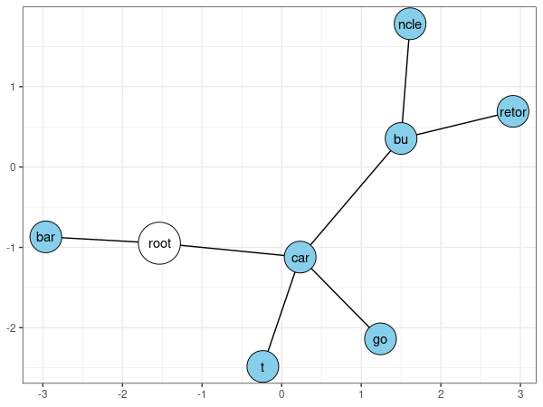

<!--  -->
 
<!-- [](https://cran.r-project.org/package=seqtrie) [](https://cran.r-project.org/package=seqtrie) -->
<!-- [](https://cran.r-project.org/package=seqtrie) -->

`seqtrie` is a collection of Radix Tree and Trie-based algorithms, including functions for calculating string distances (Hamming and Levenshtein distances). 

A Radix Tree (aka Compact Prefix Tree) is a space efficient data structure for storing sequences with quick O(1) insertion and lookup (like a hashmap or dictionary). Sequences are stored by paths along the tree, with each node/branch representing a common prefix of all child nodes. 

One advantage of this structure is the ability to search for similar sequences in logarithmic time (with respect to the tree size). Hence, this type of data structure is sometimes used as a database to work with DNA and protein sequence alignment. 

See: https://en.wikipedia.org/wiki/Radix_tree

In `seqtrie`, there is one `R6` class `RadixTree`. The primary class functions for interacting with a tree are `$insert()` for inserting sequences on the tree, `$erase()` for erasing sequences from the tree and `$search()` for finding similar sequences stored on the tree. 

### Install
```{r, eval = FALSE}
devtools::install_github("traversc/seqtrie")
```

### Simple example

To demonstrate the interface, bBelow is a simple example where we insert some sequences (strings), erase a string and then plot out the tree. 

```{r, eval = FALSE}
tree <- RadixTree$new()
tree$insert(c("cargo", "cart", "carburetor", "carbuncle", "bar", "zebra"))
tree$erase("zebra")
tree$graph()
```
{width=576px}
<!-- png("simple_tree.png", width = 576*6, height = 300*6, res = 300) -->

### Levenshtein "edit distance" search

Below is an example using COVID19 T-cell data from Adaptive Biotechnologies. (https://www.ncbi.nlm.nih.gov/pmc/articles/PMC7418738/. This data is licensed under CC 4.0.)

Here, we find highly similar sequences within a fixed edit distance. 

```{r eval = FALSE}
# create a new tree and insert 130,000 "CDR3" sequences
data(covid_cdr3) 
tree <- DNATree$new()
tree$insert(covid_cdr3)

# search for similar sequences within an edit distance of 2 ~ this may take a minute or two
results <- tree$search(covid_cdr3, max_distance=2, mode="levenshtein", nthreads=8)
```
### The output

The output is a data.frame mapping query (search sequences) and target (sequences inserted into the tree). 
```{r eval = FALSE}
tail(results)
#                                                query                                        target distance
# 262287          TGTGCCAGCAGCCCCGGGGACAATGAGCAGTTCTTC          TGTGCCAGCAGCCCGGGGACAATTGAGCAGTTCTTC        2
# 262288          TGTGCCAGCAGCCCCGGGGACAATGAGCAGTTCTTC          TGTGCCAGCAGCCCGGGGACTAATGAGCAGTTCTTC        2
# 262289          TGTGCCAGCAGCCCCGGGGACAATGAGCAGTTCTTC          TGTGCCAGCAGCCTCGGGTACAATGAGCAGTTCTTC        2
# 262290          TGTGCCAGCAGCCCCGGGGACAATGAGCAGTTCTTC          TGTGCCAGCAGCGCCCGGGACAATGAGCAGTTCTTC        2
# 262291 TGTGCCAGCAGCCCTCGACTAGTCTCCTACAATGAGCAGTTCTTC TGTGCCAGCAGCCCTCGACTAGTCTCCTACAATGAGCAGTTCTTC        0
# 262292 TGTGCCAGCAGCCTCGACAGGGGAAACGCCTACGAGCAGTACTTC TGTGCCAGCAGCCTCGACAGGGGAAACGCCTACGAGCAGTACTTC        0
```

### Search parameters

The `$search()` function contains two mutually exclusive parameters: `max_distance` and `max_fraction`. 

The former parameter sets an absolute threshold for finding similar sequences, and the latter parameter sets a threshold relative to the query sequence length. 

The search time is monotonically increasing with the distance threshold, logarithmically increasing with tree size and linearly increasing with the number of query sequences and the length of each sequence. 

Overall, the algorithm is significantly faster than a pairwise/matrix edit distance calculation for finding similar sequences. 

However, *care still needs to be taken when setting parameters for searching a large number of sequences (~100,000+).*

#### Some additional examples using the `max_fraction` parameter.

****
```{r eval = FALSE}
results <- tree$search(covid_cdr3, max_fraction=0.035, mode="levenshtein", nthreads=8) # ~several seconds
results <- tree$search(covid_cdr3, max_fraction=0.06, mode="levenshtein", nthreads=8) # ~1 minute
results <- tree$search(covid_cdr3, max_fraction=0.15, mode="levenshtein", nthreads=8) # ~15-20 minutes
```

### Hamming distance search

Hamming distance is similar to Levenshtein distance, but does not allow insertions or deletions. Sequences must be the same length. 

Because of this restriction, Hamming distance is generally a lot faster. 

```{r eval = FALSE}
results <- tree$search(covid_cdr3, max_fraction=0.035, mode="hamming", nthreads=8) # ~1 second
results <- tree$search(covid_cdr3, max_fraction=0.06, mode="hamming", nthreads=8) # ~ several seconds
results <- tree$search(covid_cdr3, max_fraction=0.15, mode="hamming", nthreads=8) # ~ 1.5 minutes
```

### Finding strings that start with a pattern

The `$find_prefix()` function can be used to find similar sequences. 

```{r eval = FALSE}
tree <- RadixTree$new()
tree$insert(c("cargo", "cart", "carburetor", "carbuncle", "bar"))
tree$prefix_search("car")

#   query     target
# 1   car  carbuncle
# 2   car carburetor
# 3   car       cart
# 4   car      cargo

tree$graph()
```

